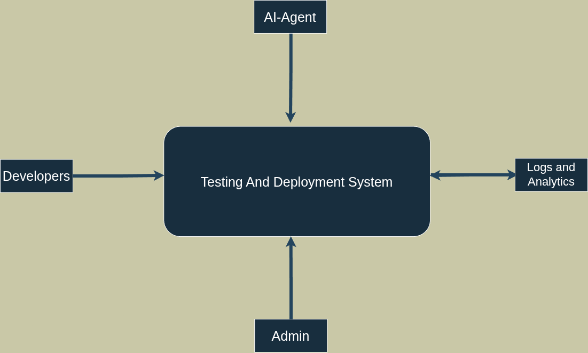
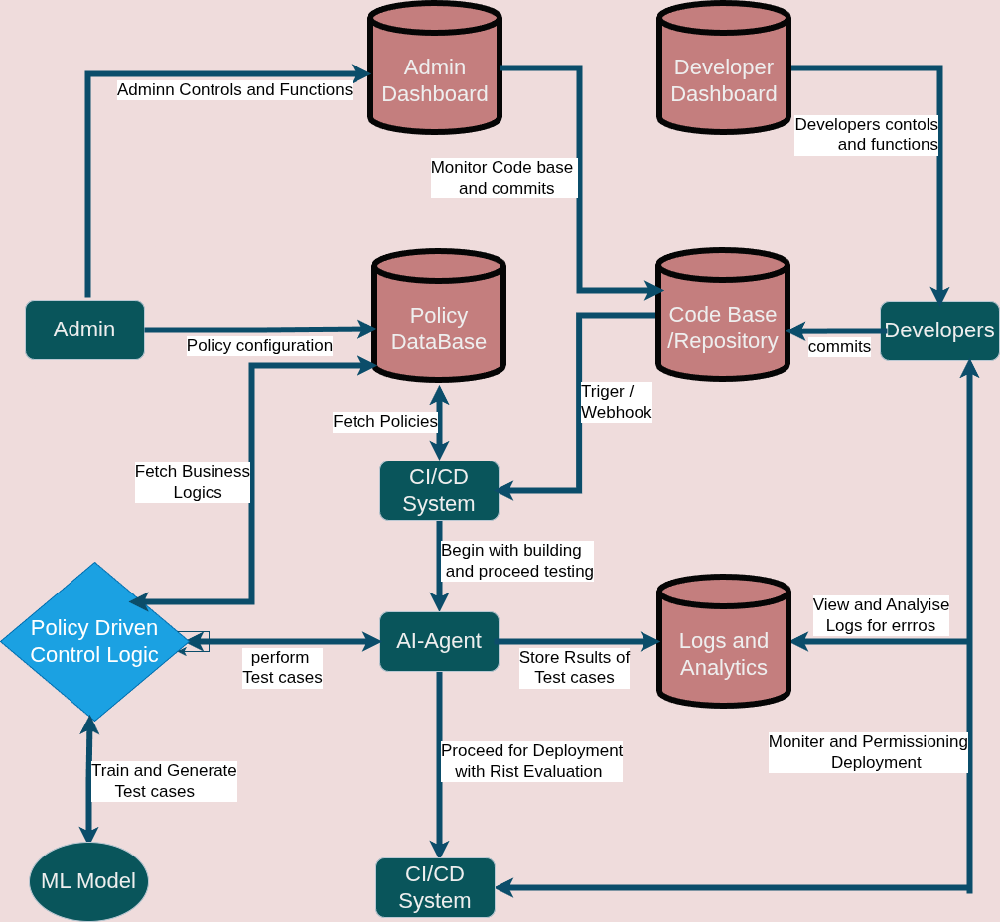

# AI-Based Automated Test Case Generation Integrated with CI/CD

## 📌 Project Overview

This project implements an AI-driven automated test case generation system integrated with a CI/CD pipeline. The system is event-driven: code commits trigger webhooks, the backend analyzes changes and invokes AI to generate tests, and a CI/CD pipeline runs the generated tests.

The repository contains:
- `app.py` — CLI-style runner that calls `stage0_compile.file_reader` to process code samples.
- `webapp.py` — Flask-based web UI to upload or select sample files and display results.
- `Backend/src` — Node.js backend (webhook/dashboard parts).

---

## 🎯 Objectives

- Automate test case generation using AI
- Trigger CI/CD pipelines automatically on commits
- Provide a dashboard and logs for visibility

---

## 🔁 Quick Start

**Prerequisites:** Python 3.9+ and pip. Node.js is optional if you want to run the Node backend.

- **Create & activate Python virtualenv (optional but recommended):**

```bash
python3 -m venv cicd
source cicd/bin/activate
```

- **Install Python dependencies:**

```bash
pip install -r requirements.txt
```

- **Run the Flask web UI (recommended):**

```bash
python3 webapp.py
```

Open http://localhost:5000 in your browser. The UI allows uploading a file or choosing an existing sample from `samples/` and shows the output returned by `process_submission()`.

- **Run the CLI runner (prints to terminal):**

```bash
python3 app.py
```

- **Optional: start Node backend (if you use the dashboard/webhook components):**

```bash
cd Backend/src
# install dependencies if package.json exists
npm install
node app.js
```

Files uploaded via the web UI are stored in an `uploads/` folder created automatically at the project root.

---

## 🔄 System Flow (concise)

1. Developer pushes code → Git sends webhook to backend
2. Backend extracts changed files and metadata
3. AI generates unit/API test cases for changed code
4. CI/CD (e.g., GitHub Actions) runs generated tests
5. Results, logs and coverage are stored and surfaced on the dashboard

---

## 📌 Diagrams

<p align="center">
  
</p>

<p align="center">
  
</p>

<p align="center">
  
</p>

---


