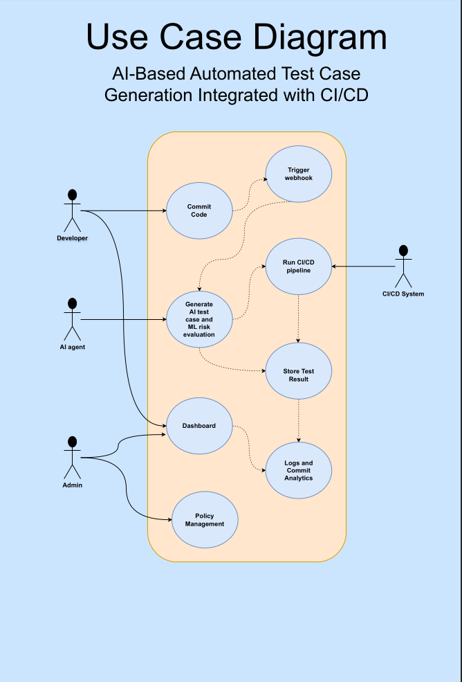
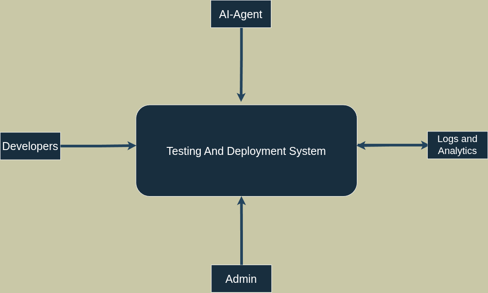
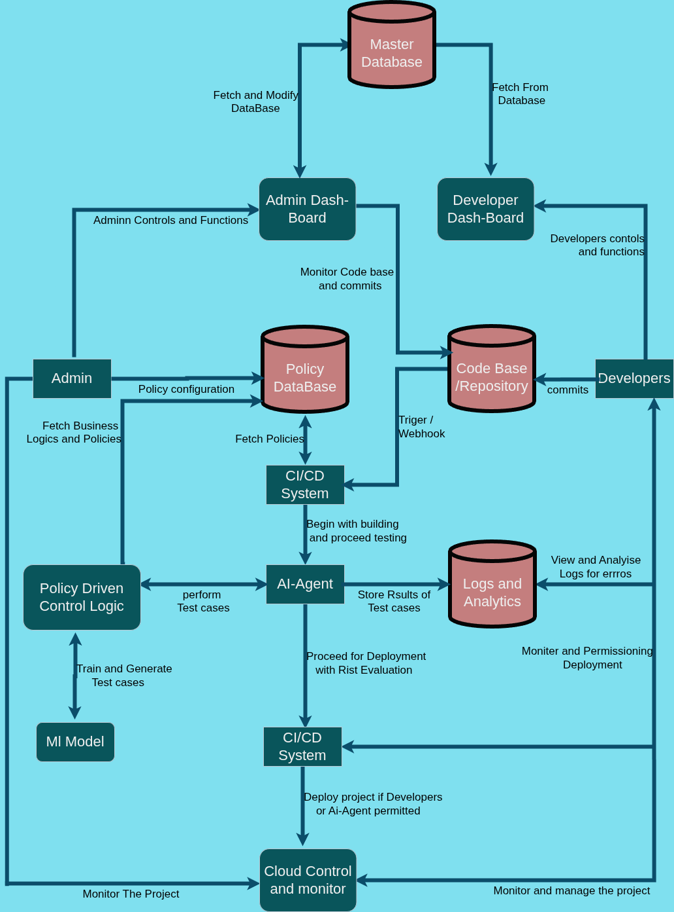
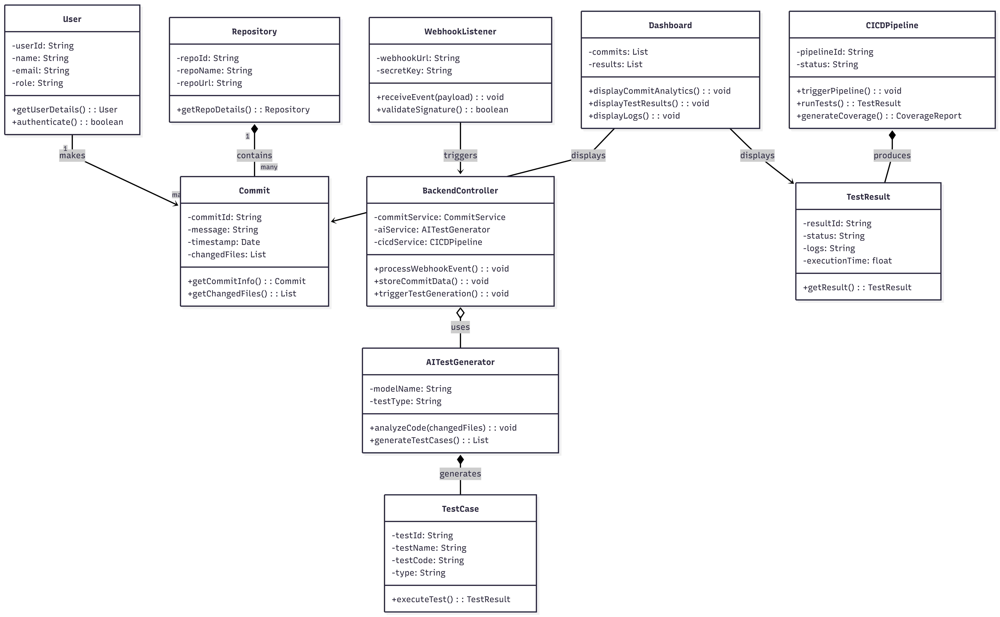

# AI-Based Automated Test Case Generation Integrated with CI/CD

## 📌 Project Overview

This project implements an AI-driven automated test case generation system integrated with a CI/CD pipeline. The system is event-driven: code commits trigger webhooks, the backend analyzes changes and invokes AI to generate tests, and a CI/CD pipeline runs the generated tests.

The repository contains:
- `app.py` — CLI-style runner that calls `stage0_compile.file_reader` to process code samples.
- `webapp.py` — Flask-based web UI to upload or select sample files and display results.
- `Backend/src` — Node.js backend (webhook/dashboard parts).

---

## 🎯 Objectives

- Automate test case generation using AI
- Trigger CI/CD pipelines automatically on commits
- Provide a dashboard and logs for visibility

---

## 🔁 Quick Start

**Prerequisites:** Python 3.9+ and pip. Node.js is optional if you want to run the Node backend.

- **Create & activate Python virtualenv (optional but recommended):**

```bash
python3 -m venv cicd
source cicd/bin/activate
```

- **Install Python dependencies:**

```bash
pip install -r requirements.txt
```

- **Set up environment variables (for AI features):**

```bash
# Copy the .env file from Intelligence-Module or create your own
cp Intelligence-Module/.env .env
# Edit .env to add your GEMINI_API_KEY if needed
```

- **Run the Flask web UI (recommended):**

```bash
python3 webapp.py
```

Open http://localhost:5000 in your browser. You'll be redirected to login. Sign up first, then sign in to access the dashboard and test runner.

- **Run the CLI runner (prints to terminal):**

```bash
python3 app.py
```

- **Optional: start Node backend (if you use the dashboard/webhook components):**

```bash
cd Backend/src
# install dependencies if package.json exists
npm install
node app.js
```

Files uploaded via the web UI are stored in an `uploads/` folder created automatically at the project root.

---

## Authentication

The web UI now requires authentication. Users can sign up as Admin or Developer. Credentials are stored in the PostgreSQL database (or SQLite for local testing).

- **Sign Up:** Create an account with employee ID, name, position (admin/developer), and password.
- **Sign In:** Log in with employee ID and password.
- **Dashboard:** Access the main dashboard with links to test runner, webhooks, reports, and settings.

## AI Test Generation

The Intelligence Module provides advanced AI-powered testing capabilities using Google's Gemini API:

### Features:
- **Multi-Language Support**: Python, C, C++, and Java files
- **Two-Stage Analysis**:
  - **Stage 0**: Compilation/syntax checking
  - **Stage 1**: AI-powered semantic analysis and test generation
- **AI Analysis**: Structural feature extraction and code understanding
- **Intelligent Test Generation**: Uses hybrid search algorithms combining random search, simulated annealing, and hill climbing
- **Bug Detection**: Identifies exceptions, failures, and incorrect outputs
- **Coverage Analysis**: Line and branch coverage metrics
- **Results Display**: Shows generated test cases and bug analysis from JSON output files

### How to Use:
1. Access Test Runner from the dashboard after logging in
2. Upload a code file or select from samples
3. The system will perform AI analysis and display comprehensive results
4. View generated test cases, bug analysis, and execution results

### Test Strategies:
- **Edge Cases**: Boundary value testing
- **Branch Coverage**: Decision point testing
- **Adversarial**: Stress testing with unexpected inputs
- **Constraint-Based**: Logic constraint testing

## 📦 Dependencies

### Python Packages
- **Flask**: Web framework
- **Flask-Login**: User session management
- **Flask-WTF**: Form handling
- **Flask-SQLAlchemy**: Database ORM
- **WTForms**: Form validation
- **bcrypt**: Password hashing
- **pymongo**: MongoDB driver
- **requests**: HTTP client
- **google-generativeai**: Gemini AI API
- **python-dotenv**: Environment variable management
- **docker**: Docker API client

### External Services
- **MongoDB**: For storing webhook data and AI test results
- **PostgreSQL**: For user authentication (optional, SQLite for local dev)
- **Google Gemini API**: For AI-powered test generation

### Environment Variables
Create a `.env` file in the project root:
```
GEMINI_API_KEY=your_gemini_api_key_here
```

Copy from `Intelligence-Module/.env` or set your own API key.

## 🧪 Testing the Setup

### 1. Local Testing (SQLite):
```bash
source cicd/bin/activate
python webapp.py
```
Open http://localhost:5000, sign up, then log in to access the dashboard.

### 2. Docker Testing (PostgreSQL):
```bash
docker compose up --build
```
Access http://localhost:5000 for the web UI.

### 3. Testing AI Features:
- Ensure MongoDB is running locally (`mongod`)
- Set `GEMINI_API_KEY` in `.env` file
- Upload a code file through the AI Tests section
- The system will perform compilation check (Stage 0) followed by AI analysis (Stage 1)

### 4. CLI Testing:
```bash
python Intelligence-Module/Orchestrator.py
```
This runs the full AI pipeline on sample test files.

## Current Features

- ✅ User authentication with secure password hashing
- ✅ Role-based access (Admin/Developer)
- ✅ Improved dashboard UI with cards and navigation
- ✅ Code compilation testing for C/C++/Java/Python
- ✅ **AI-powered test case generation integrated into Test Runner**
- ✅ **Hybrid search algorithms for intelligent testing**
- ✅ **Multi-stage analysis (compilation + semantic)**
- ✅ **Bug detection and coverage analysis**
- ✅ **Results display from JSON output files**
- ✅ File upload and sample testing
- ✅ Webhook integration with MongoDB storage
- ✅ Docker containerization for all services
- ✅ Fixed authentication bugs (UserMixin inheritance)

---

## 📌 Diagrams

<p align="center">
  
</p>

<p align="center">
  
</p>

<p align="center">
  
</p>

<p align="center">
  
</p>
---


## Microservices / Docker (Local)

This repository includes Dockerfiles for the Flask web UI, the Node.js backend, and a Python worker, and a `docker-compose.yml` to build and run everything locally on one machine.

- Single-command local build & deploy (recommended):

```bash
make build     # builds all service images in parallel
make up        # starts services in background (detached)
```

- Or with docker-compose directly:

```bash
docker-compose up --build -d
```

- Stop and remove services:

```bash
make down
# or
docker-compose down
```

- View logs:

```bash
make logs
```

Files added for local microservice orchestration:

- `Dockerfile.web` — Dockerfile for the Flask UI (`webapp.py`)
- `Backend/src/Dockerfile.api` — Dockerfile for the Node API (`Backend/src/app.js`)
- `Dockerfile.worker` — Dockerfile for the Python worker (`stage0_compile.py`)
- `docker-compose.yml` — orchestrates `web`, `api`, `worker`, and `db` (Postgres)
- `Makefile` — convenience targets: `build`, `up`, `down`, `logs`, `ps`

Notes & assumptions:

- This setup is intended for local development and testing only (single-machine deployment).
- The Node backend will run `node app.js`. If you add dependencies, include a `package.json` in `Backend/src`.
- Python services reuse the repository `requirements.txt` to install Python dependencies.
- Persistent Postgres data is stored in a Docker volume named `db_data`.

Docker Compose notes:

- If `make build` fails with `make: docker-compose: No such file or directory`, your system has no `docker-compose` binary. Modern Docker installations provide the Compose V2 plugin which is invoked as `docker compose` (note the space).
- The project's `Makefile` detects either `docker-compose` or `docker compose`. If neither is found you can install one of them:

  - Install Docker Compose V2 plugin (recommended with recent Docker Engine):

  ```bash
  # Debian/Ubuntu example
  sudo apt update
  sudo apt install docker.io  # if Docker Engine is missing
  # Ensure Docker CLI has compose plugin; or install using Docker's docs:
  # https://docs.docker.com/compose/install/
  ```

  - Or install the standalone `docker-compose` binary:

  ```bash
  sudo curl -L "https://github.com/docker/compose/releases/download/1.29.2/docker-compose-$(uname -s)-$(uname -m)" -o /usr/local/bin/docker-compose
  sudo chmod +x /usr/local/bin/docker-compose
  docker-compose --version
  ```

After installing, re-run:

```bash
make build
make up
```


